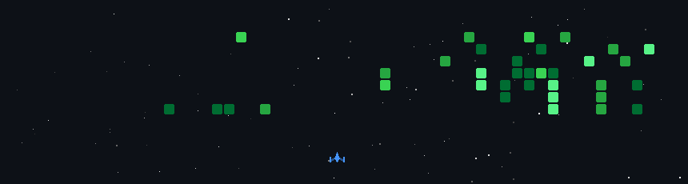

<div align="center">


<br/>

[](https://git.io/typing-svg)

<br/>

[](https://abhinavep-b-portfolio.vercel.app/)
[](https://www.linkedin.com/in/abhinavepb/)
[](https://www.instagram.com/__.abhinave.__?igsh=b2F2ejBvODZnb2hl/)
[](https://leetcode.com/abhinave_p_b/)
[](mailto:abhinavepb92@gmail.com)

</div>

---

<div align="center">

[About](#about) • [Tech Stack](#tech-stack) • [Projects](#projects) • [GitHub Stats](#github-stats) • [LeetCode Stats](#leetcode-stats) • [Contribution Graph](#contribution-graph) • [Contribution Snake](#contribution-snake) • [Achievements](#achievements) • [Space Shooter](#space-shooter)

</div>

---

<a name="about"></a>
## 🧑‍💻 About Me

```yaml
name        : Abhinave P B
location    : Thrissur, Kerala, India 🇮🇳
focus       : Cloud Infrastructure · AI/LLM · Full-Stack · Creative Dev
```

- 🔨 I build things that range from **cloud pipelines** to **head-controlled browser extensions**
- 🧠 Passionate about making tech accessible
- 🚢 My workflow: *ideate → build → ship → document → repeat*
- 🎮 Yes, I also build games for fun

---

<a name="tech-stack"></a>
## 🛠️ Tech Stack

<div align="center">

**Languages**


**DevOps & Cloud**


**Databases & Backend**


**Frontend & Design**


</div>

---

<a name="projects"></a>
## 🚀 Projects

### 🌟 Flagship Builds

<table>
  <tr>
    <td width="50%" valign="top">
      <h3>🚗 ParkWatch — Smart ANPR Parking System</h3>
      <p>A full-stack Automatic Number Plate Recognition platform for Indian vehicles. A <strong>YOLOv8 + PaddleOCR/EasyOCR</strong> Python pipeline detects and reads plates in real time, feeding a <strong>React</strong> admin dashboard and a <strong>React Native/Expo</strong> Android app, all backed by <strong>Supabase</strong>.</p>
      <p>
        
        
        
        
        
      </p>
      <a href="https://github.com/abhinav-e-p-b/APS">
        
      </a>
    </td>
    <td width="50%" valign="top">
      <h3>🎨 LUTify — Photo Color Grading App</h3>
      <p>A full-stack web app for applying cinematic <strong>LUT (Look-Up Table)</strong> color grades to photos. Features real-time before/after preview, webcam capture, intensity control, and one-click export.</p>
      <p>
        
        
        
        
      </p>
      <a href="https://github.com/abhinav-e-p-b/colorflow-photo-lab">
        
      </a>
    </td>
  </tr>
  <tr>
    <td width="50%" valign="top">
      <h3>🎯 Knock-out — Head-Scroll Chrome Extension</h3>
      <p>Too lazy to scroll? This Chrome extension uses your <strong>webcam + face detection AI</strong> to scroll webpages by nodding your head. GPU-accelerated via FaceDetector API with Web Worker fallback.</p>
      <p>
        
        
        
        
      </p>
      <a href="https://github.com/abhinav-e-p-b/Knock-out">
        
      </a>
    </td>
    <td width="50%" valign="top">
      <h3>💰 Crypto Fortune Teller</h3>
      <p>A crypto calculator and price predictor built with TypeScript. Helps users explore what-if scenarios for their crypto investments with fortune-style insights.</p>
      <p>
        
        
      </p>
      <a href="https://github.com/abhinav-e-p-b/crypto-fortune-teller-calculator">
        
      </a>
    </td>
  </tr>
  <tr>
    <td width="50%" valign="top">
      <h3>📺 Netflix Clone</h3>
      <p>A pixel-perfect Netflix UI clone built in JavaScript. Reproduces the browsing experience including hero sections, carousels, and responsive design.</p>
      <p>
        
        
      </p>
      <a href="https://github.com/abhinav-e-p-b/Netflix_clone">
        
      </a>
    </td>
    <td width="50%" valign="top"></td>
  </tr>
</table>

---

### ☁️ ML & AI Projects

<table>
  <tr>
    <td align="center" width="33%">
      <br/><br/>
      <b>⚙️ Two-Tier Flask CI/CD Pipeline</b><br/>
      <sub>Fully automated CI/CD pipeline deploying a Flask + MySQL app on AWS EC2 using Jenkins, Docker, and Docker Compose. Hands-free deployments triggered on every git push.</sub><br/><br/>
      <a href="https://github.com/abhinav-e-p-b/DevOps-Project-Two-Tier-Flask-App">
        
      </a>
      <br/><br/>
      
      
      
      
    </td>
    <td align="center" width="33%">
      <br/><br/>
      <b>🏥 De-Addiction App</b><br/>
      <sub>A Flutter-based mobile application built for a hackathon to support de-addiction journeys. Cross-platform (Android & iOS) with a focus on user recovery workflows.</sub><br/><br/>
      <a href="https://github.com/abhinav-e-p-b/De-Addiction-App">
        
      </a>
      <br/><br/>
      
      
      
    </td>
    <td align="center" width="33%">
      <br/><br/>
      <b>🔍 Build a RAG API</b><br/>
      <sub>A Retrieval-Augmented Generation API that combines vector search with LLMs to answer queries grounded in your own documents. Built for scalable, context-aware AI responses.</sub><br/><br/>
      <a href="https://github.com/abhinav-e-p-b/Build-a-RAG-API">
        
      </a>
      <br/><br/>
      
      
      
    </td>
  </tr>
  <tr>
    <td align="center" width="33%">
      <br/><br/>
      <b>🎨 MNIST GAN Studio</b><br/>
      <sub>PyTorch GAN implementation with an interactive Flask + Socket.IO web UI for real-time training visualization and handwritten digit generation. Includes checkpoint management, live loss metrics, and one-click image export.</sub><br/><br/>
      <a href="https://github.com/abhinav-e-p-b/MNIST-GAN-Project">
        
      </a>
      <br/><br/>
      
      
      
    </td>
    <td align="center" width="33%"></td>
    <td align="center" width="33%"></td>
  </tr>
</table>

---

<a name="github-stats"></a>
## 📊 GitHub Stats

<div align="center">


&nbsp;


<br/>


</div>

---

<a name="leetcode-stats"></a>
## 🧩 LeetCode Stats

<div align="center">

<a href="https://leetcode.com/abhinave_p_b/">
  
</a>

</div>

---

<a name="contribution-graph"></a>
## 📈 Contribution Graph
<p align="center">
  
</p>

---

<a name="achievements"></a>
## 🏆 Achievements

<div align="center">

[](https://github.com/ryo-ma/github-profile-trophy)

</div>


---

<a name="space-shooter"></a>
## 🎮 Space Shooter — Built for Fun

> A pixel-art space shooter shipped from scratch — because real builders ship games too.

<p align="center">
  
</p>

---


<div align="center">


*"Build in public. Learn out loud. Ship relentlessly."*


</div>
